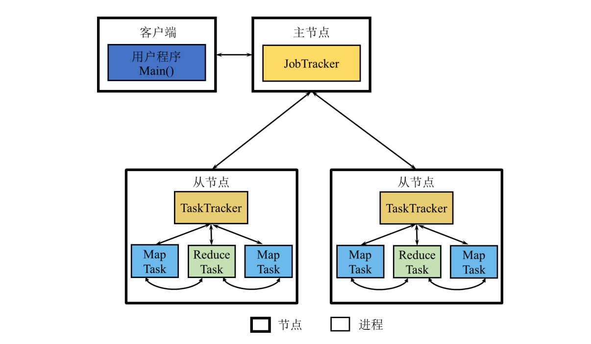
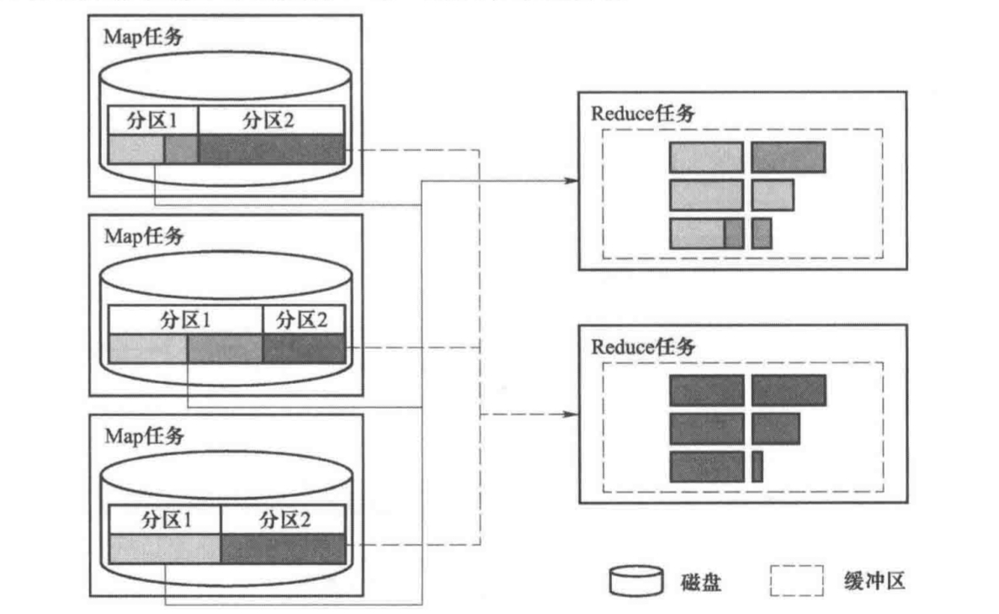

# 分布式MapReduce框架

这是一个简易但功能完整的分布式MapReduce框架，包含JobTracker（Master）和TaskTracker（Worker）组件，支持 Map（含可选的 Combine）、Shuffle 与 Reduce 三大阶段的任务执行流程。

## 1 总体架构设计

本框架采用主从架构（Master-Worker），由以下主要组件构成：

- JobTracker（Master节点）：以进程形式在后台运行，负责整个系统的资源管理、作业管理（任务调度）等。
- TaskTracker（Worker节点）：以进程形式在从节点后台运行，管理该节点的资源，接收 JobTracker 发送的命令并执行，如执行具体的 Map 和 Reduce 任务等，周期性的向 JobTracker 发送心跳和汇报任务状态等。
  - 采用固定线程池设计，slot 数设定为 5，即每个 TaskTracker 节点可并行执行最多 5 个任务实例。
- 客户端（Client）：提交应用程序启动的进程，将 MapReduce 作业提交给 JobTracker。
- Task（任务实例）：Worker节点在作业执行过程中启动的线程，负责执行具体的 Map 任务或 Reduce 任务。



## 2 模块划分与职责

### 2.1 JobTracker 模块 ( JobTracker.java )

`JobTracker` 作为 Master 节点，主要承担以下职责：

##### 2.1.1.作业接收与任务解析（ `handleJobSubmission` ）

- 客户端提交作业后，JobTracker 会解析 Job 参数，决定使用用户指定的 map 数量还是根据文件大小自动拆分。
  - 可序列化的 `Job` 类（ Job.java )：统一管理和传递用户提交的 MapReduce 作业参数。
- 使用 `InputSplitter` 工具将输入文件划分为多个 split，每个 split 对应一个 map task。
- 每个任务被封装为 `Task` 实例，配置好执行所需的 mapper/reducer/combiner 类及中间路径。
  - 可选是否使用 Combiner。

##### 2.1.2.任务调度与资源管理（（`assignTask`, `assignPendingTasks`, `getLeastLoadedTaskTracker`）

- 调用 `getLeastLoadedTaskTracker`，计算各个 TaskTracker 的当前任务数与最大 slot 数比例，选择负载最小的节点进行分配。
- 所有任务的调度通过 socket 通信完成，调度完成后更新 `taskAssignments` 记录分配关系。

##### 2.1.3.心跳监测与容错机制（`handleHeartbeat`, `startTaskTrackerMonitor`）

- `JobTracker` 初始化时启动一个心跳检测的守护线程。
- 每个 TaskTracker 定期向 JobTracker 发送 `HeartbeatMessage`，包含当前 slot 数、运行任务数量、其端口号、消息发送时的时间。
  - 可序列化的 `HeartbeatMessage` 类（HeartbeatMessage.java)。
- JobTracker 启动定时器，检测每个 TaskTracker 最近一次心跳时间，超过 15 秒，认为其失联。
  - 对于失联的节点：
    - 从活跃的TaskTracker列表中；
    - 回收其未完成任务，将其状态重置为 PENDING，然后立即重新分配这些任务，减少延迟。

##### 2.1.4.状态跟踪与阶段控制（`handleStatusUpdate`, `checkAndScheduleReduceTasks`, `checkJobCompletion`）

- 每个 Task 开始或完成时会向 JobTracker 汇报 `StatusReport`，更新任务状态。
  - 可序列化的 `StatusReport` 类（StatusReport.java)。
- JobTracker 监控作业中所有 map 任务完成进度，达到 `reduceStartThreshold`（60%）时，触发 Reduce 阶段的任务生成与调度。
- 当 Reduce 阶段任务全部完成后，标记 Job 为 COMPLETED。

### 2.2 TaskTracker 模块 ( TaskTracker.java )

`	TaskTracker` 作为 Worker 节点，主要承担以下职责：

##### 2.2.1.接收并执行任务（ `executeTask`)

- `start()` 方法中，监听端口、接受 JobTracker 发来的任务对象。
- 设置任务状态为 STARTED 并依据任务类型执行具体逻辑。

###### 2.2.1.1 执行 Map 任务逻辑（ `executeMapTask` )

- 动态加载 Mapper 和 Combiner（可选）。
- 从对应的逻辑分区中读入分片数据。
- 按键的哈希值进行分区，写入多个输出文件（part-i.txt），总分区数等于 Reduce 任务的数量。
- Combiner 优化：内存中进行本地聚合，将返回的结果对写入对应分区输出文件。

###### 2.2.1.2 执行 Reduce 任务逻辑（ `executeReduceTask` )

- 动态加载 Reducer。
- 拉取所有 map 输出目录中属于自己 `partitionId` 的中间文件。
- 读取 `part-i.txt` 文件中的 `<key, value>` 对，并按 key 分组。
- 对key进行排序后，对每个 key 调用 Reducer 的 `reduce()` 方法输出最终结果。



##### 2.2.2 任务状态报告（ `sendStatusReport` )

- 在任务执行的每个阶段，都会调用这个函数，发送报告给 JobTracker。

##### 2.2.3 定期发送心跳（ `startHeartbeat` )

-  心跳线程每10秒执行一次，构造 `HeartbeatMessage`，包括运行中任务数、当前所有任务状态等。

##### 2.2.4 管理任务生命周期（ `cleanupCompletedTasks` )

-  所有提交的任务存入 `runningTasks`。

- 设置每10s清理一次已完成的任务。

### 2.3 客户端模块（Client.java）

`Client`向 JobTracker 提交 MapReduce 作业，并传递相关配置与参数。

- 可选参数：[combinerClass] [numMapTasks]。
- 根据参数创建 Job 实例，然后通过网络发送作业给 Jobtracker。

### 2.4 Task（Task.java）

​	表示一个 Map 任务或一个 Reduce 任务，封装了：

- 输入输出路径
- 使用的类（Mapper / Reducer / 可选的 Combiner）
- 分区编号（仅 Reduce 任务有）
- 任务状态（是否已完成、是否失败）
- 被哪个 TaskTracker 执行了

### 2.5 其他工具类 （/utils)

##### 1.`InputSplitter`

​	MapReduce 框架中的输入切片工具类，负责将输入文件划分成多个逻辑分片（split），供后续的 Map 任务并行处理。

- 根据文件大小自动估算切片数量（Map任务数）
  - 小文件场景：默认每个 Map 任务处理约 64 字节数据
- 或根据用户指定的 Map 任务数量来划分输入；
  - 切片数量受 `MIN_SPLITS`（1）和 `MAX_SPLITS`（10）限制，防止划分过细或遗漏数据；
- 每个 split 逻辑上表示为一段“起始行号-结束行号”的范围；
  - 由 `FileSplit` 封装并转换为字符串表示，便于序列化；
- Map 任务执行时反序列化字符串，从输入文件中读取对应行数内容进行处理。

##### 3.`NetworkUtils`

​	网络通信工具类，封装了 Socket 通信的底层细节：

- 发送对象（如任务、心跳信息等）到指定地址和端口。
- 从监听端口接收对象。

##### 2.`FileUtils`

​	文件操作工具类：

- 创建目录（中间结果路径）。
- 清理指定目录中的所有文件与子目录。

##### 3.`PartitionUtils`

​	分区工具类，根据 Reduce 任务的数量计算给定的 key 的任务分区 ID

## 3 运行流程

1. 首先启动JobTracker服务
2. 然后启动TaskTracker服务（可以启动多个TaskTracker实例）
3. 最后通过Client提交作业

## 4 如何运行

##### 1. 编译代码

```bash
javac -d target java/src/distributed/*.java java/src/distributed/utils/*.java java/src/client/*.java java/src/udf/*.java
```

##### 2. 启动 JobTracker

```bash
cd /home/apricity/workspace/MapReduce
java -cp target distributed.JobTracker [port]
```

例如，使用端口9001：
```bash
java -cp target distributed.JobTracker 9001
```

##### 3. 启动 TaskTracker

```bash
cd /home/apricity/workspace/MapReduce
java -cp target distributed.TaskTracker <taskTrackerPort>
```

例如，TaskTracker使用端口9002
```bash
java -cp target distributed.TaskTracker 9002
```

###### 启动多个TaskTracker

可以启动多个TaskTracker实例，每个使用不同的端口：

```bash
# 启动第一个TaskTracker
java -cp target distributed.TaskTracker 9002

# 启动第二个TaskTracker
java -cp target distributed.TaskTracker 9003

```

##### 4. 提交WordCount作业

```bash
cd /home/apricity/workspace/MapReduce
java -cp target client.Client <inputPath> <outputPath> <mapperClass> <reducerClass> <numReducers> [combinerClass] [numMapTasks] [jobTrackerPort]
```

基本示例：
```bash
java -cp target client.Client input.txt output udf.WordCountMapper udf.WordCountReducer 3 
```

使用Combiner进行本地聚合：
```bash
java -cp target client.Client input.txt output udf.WordCountMapper udf.WordCountReducer 3 udf.WordCountCombiner
```

用户指定map任务数量：
```bash
java -cp target client.Client input.txt output udf.WordCountMapper udf.WordCountReducer 3 "" 5
```

Combiner+用户指定map任务数量：
```bash
java -cp target client.Client input.txt output udf.WordCountMapper udf.WordCountReducer 3 udf.WordCountCombiner 5
```
